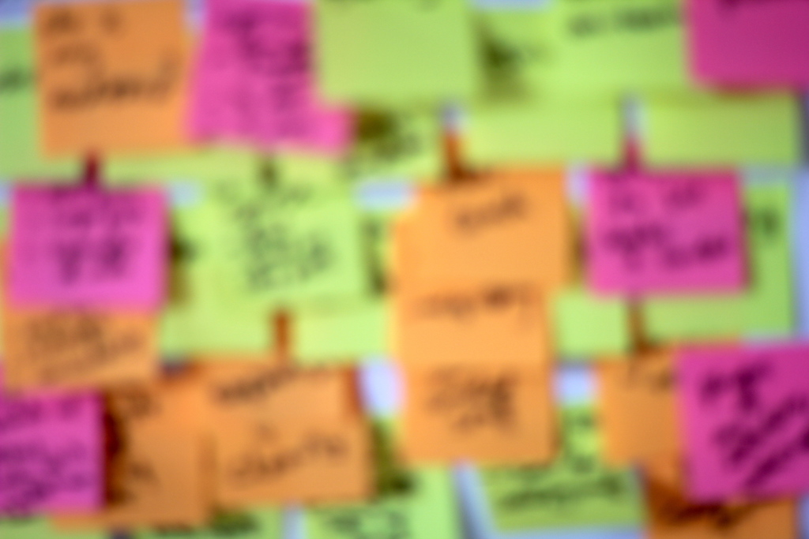
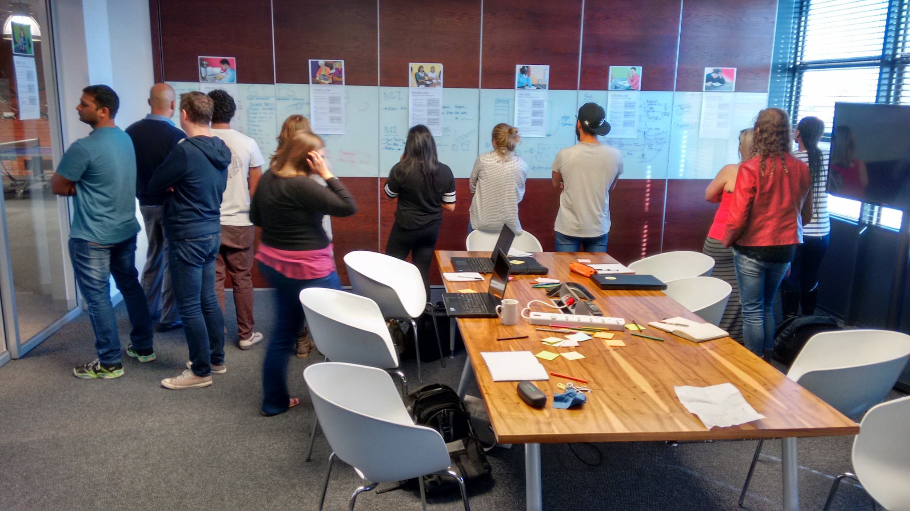
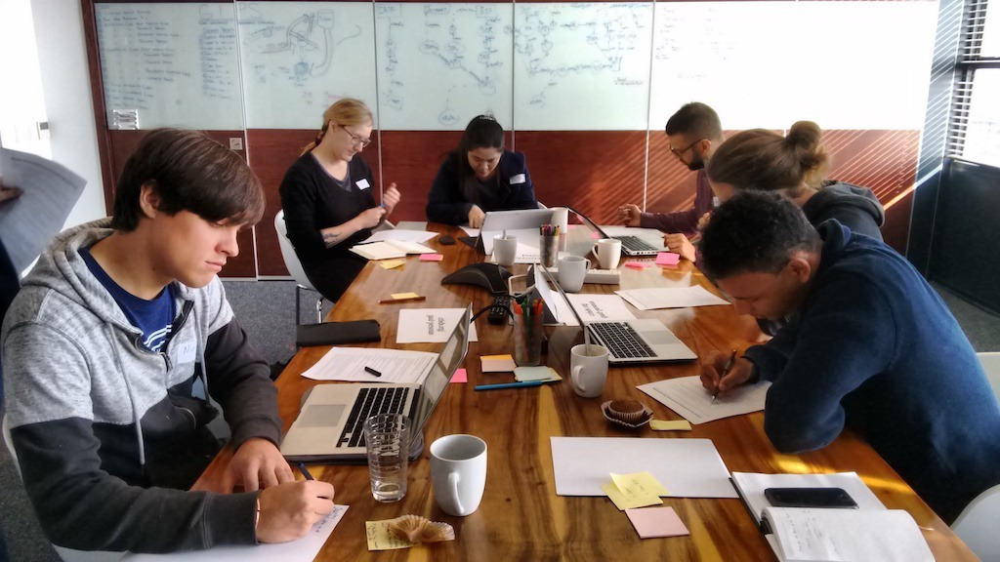
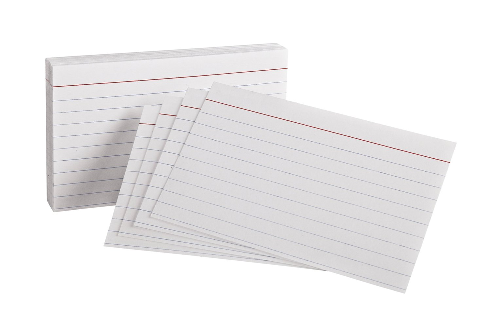

Theme: Fira, 2

## Who will you share the stuff from the workshop with?
## **Share your answer with 3 people**

---

# Disability

---

## Know someone with this barrier?
## **Add a tick ✔︎**

---

# Personas tour

^ Read them!
About 10m

---

## What was the most interesting thing?
## **1. Write it on a sticky**
## **2. Share with your table**

^ Solo write, then discuss with table
Table shout outs. At least one from each table.
About 5m + 5m

---

## Do GAAD activities
## **ctfeds.org/gaad-act-2017**

^ First big chunk of work
Cover them all
About 50m

---

## What was the most important thing you learned?
## **1. Write it on a sticky**
## **2. Share with your table**

^ Solo write, then discuss with table
Table shout outs. At least one from each table.
About 5m + 5m

---

# Lightning Talk

^ About 10m

---

## Teach Access Tutorial
## **teachaccess.github.io/tutorial**

^ Second big chunk of work
Cover as much as you can
About 50m

---

## What was your favourite exercise?
## **1. Write it on a sticky**
## **2. Share with your table**

^ Solo write, then discuss with table
Table shout outs. At least one from each table.
About 5m + 5m

---

## Resources
## **ctfeds.org/gaadr2017**

---

## Accessibility At Your Office
## **SMART Goal**

^ Who will you share the stuff from the workshop with?
Will you save time? Save money?

---

## Facilitator Feedback
## **One thing we could do differently**

^ Anonymous is fine
5m
