Theme: Fira, 2

## Who will you share the stuff from the workshop with?
## **Share your answer with 3 people**

---

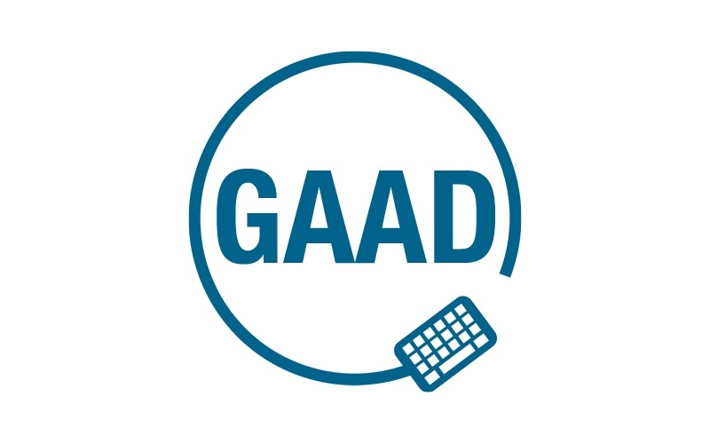

^ 6th global GAAD, 2nd CTFEDs GAAD
Take accessibility mainstream.
Talk, think, learn about inclusion
Intro selves!

---

### **Agenda**

## 2 x **"do stuff"** blocks
## **walking and talking** inbetween
## end with a **To Do**

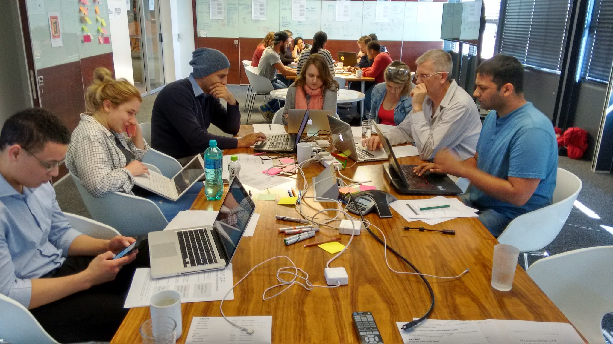

^ learn by doing
walk and talk: keep braing going
To do: keep it going at work

---

## Know someone with this barrier?
## **Add a tick ✔︎**

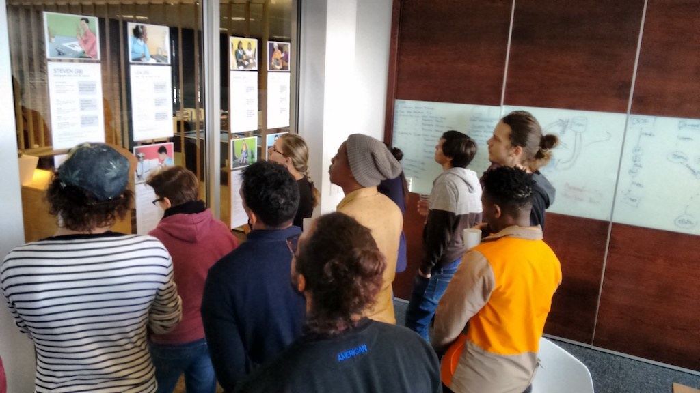

---

# Personas tour

^ Read them!
About 10m

---

## What was the most interesting thing?
## **Write it on a sticky**

^ Solo write
About 5m

---

## What was the most interesting thing?
## **Share with your table**

^ Discuss with table
Table shout outs. At least one from each table.
About 5m

---

## Do GAAD activities
## **ctfeds.org/gaad-act-2017**

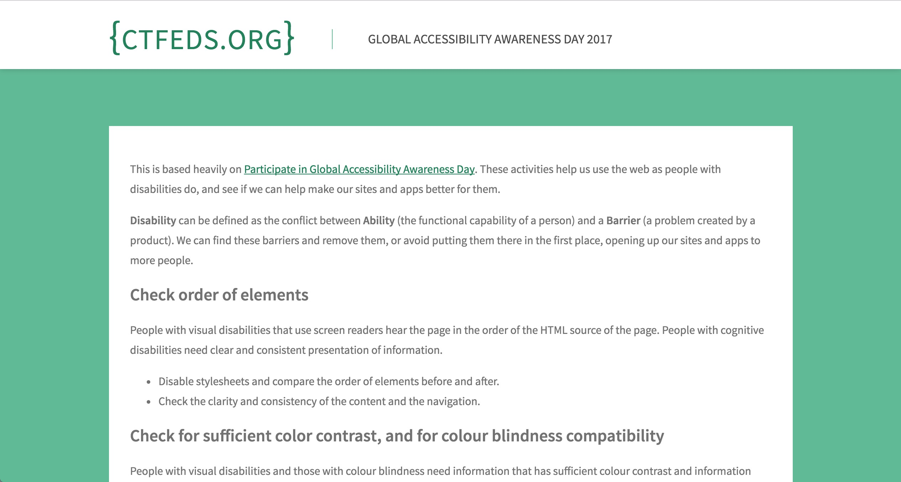

^ First big chunk of work
Cover them all
What site? Yours! Ones you use.
About 50m

---

## What was the most important thing you learned?
## **Write it on a sticky**

^ Solo write
About 5m

---

## What was the most important thing you learned?
## **Share with your table**

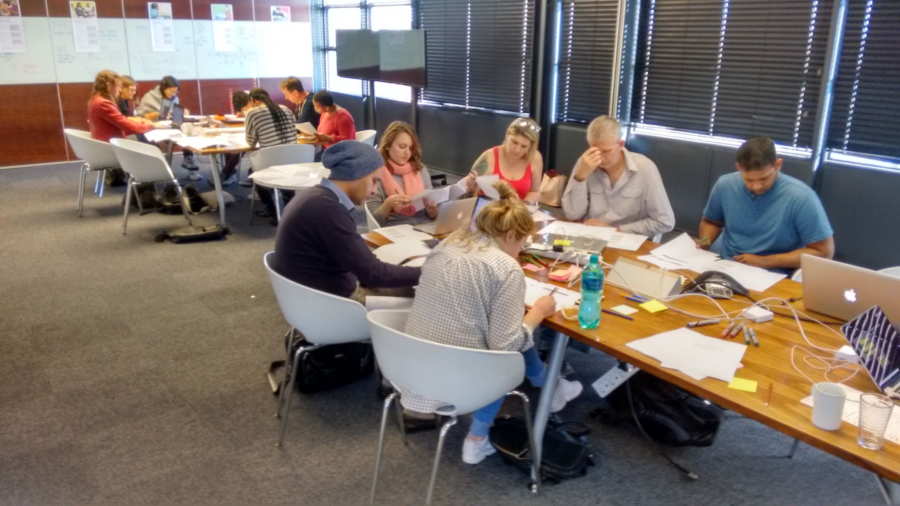

^ Discuss with table
Table shout outs. At least one from each table.
About 5m

---

## Making accessiblity **mainstream**

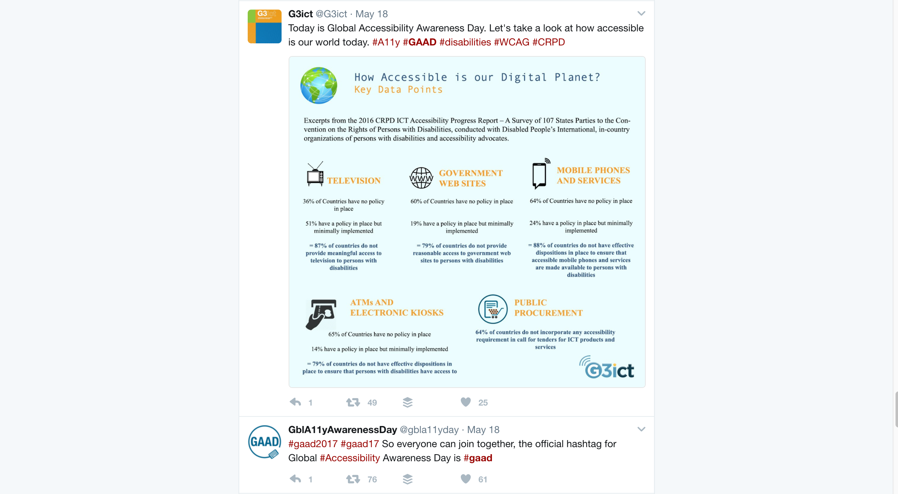

---

## How long have you been making **responsive sites**?
## :raised_hand:

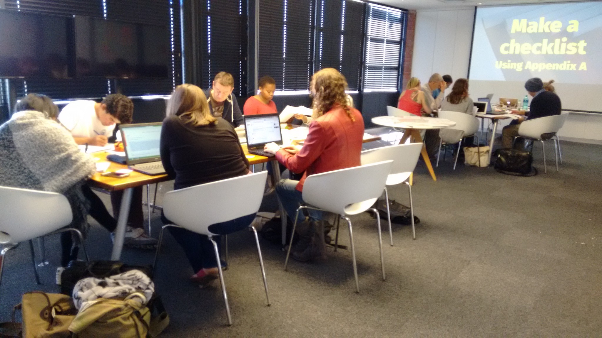

^ Hand up, keep it up
1 year or less? 3? 5? 10?
Original article was May 25, 2010

---

## **Why** do we make responsive sites?
## :pencil:

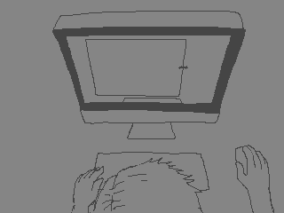

^ Why did you start?
Why did you continue?

---

## **Why** do we make accessible sites?
## :pencil:

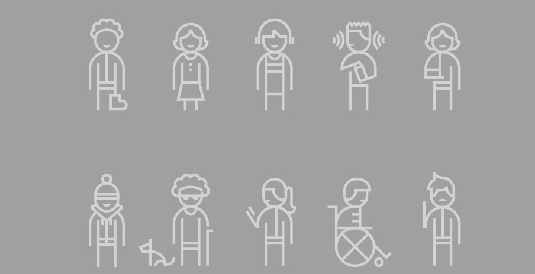

^ Or want to make
We'll come back to this at the end
What's in common?
J & S talk through results

---

# **Break**
## (just 10m, please!)

---

## Teach Access Tutorial
## **teachaccess.github.io/tutorial**

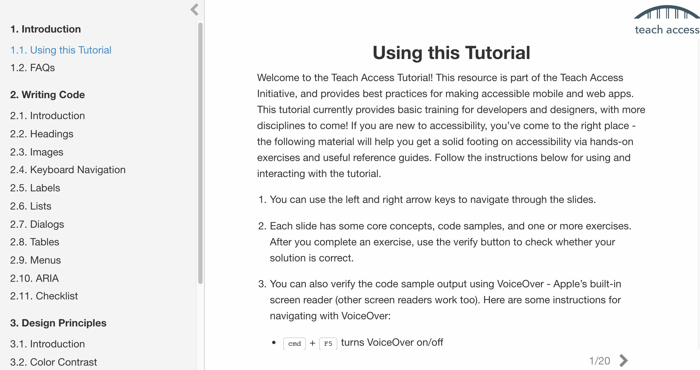

^ Second big chunk of work
Cover as much as you can
About 50m

---

## What was your favourite exercise?
## **Write it on a sticky**

^ Solo write
About 5m

---

## What was your favourite exercise?
## **Share with your table**

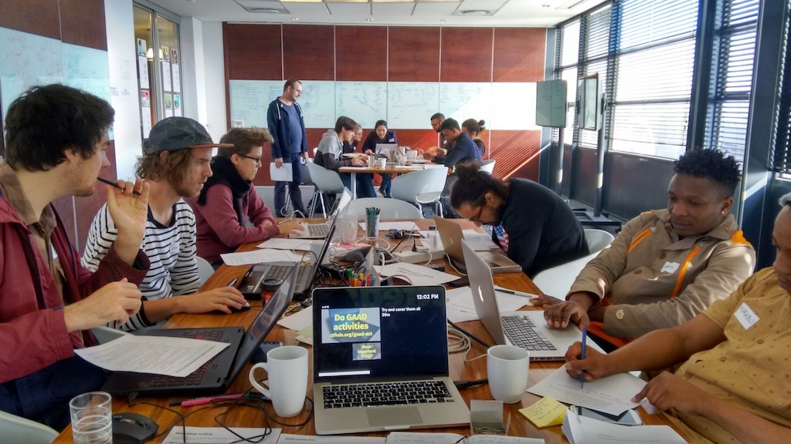

^ Discuss with table
Table shout outs. At least one from each table.
About 5m

---

## Resources
## **ctfeds.org/gaadr2017**

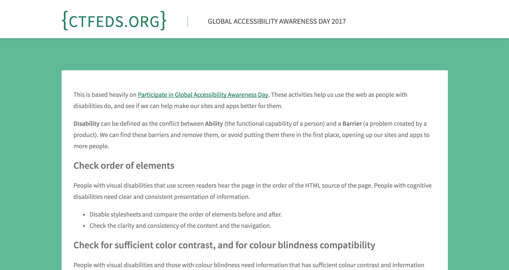

---

## Accessibility In Your Work
## **SMART Goal**

^ Who will you share the stuff from the workshop with?
Will you save time? Save money?
What's holding us back from doing a11y?

---

## Facilitator Feedback
## **One thing we could do differently**

^ Anonymous is fine
5m
